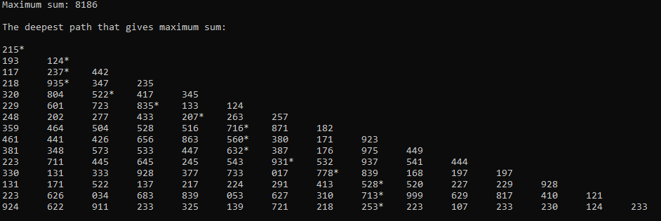

# max-sum-of-deepest-path-in-pyramid
Algorithm Challenge

## Problem
We will have an orthogonal triangle input and need to find the maximum sum of the single path according to given rules below;

1. Start from the top and move downwards to an adjacent number as in below.
2. Only allowed to walk downwards and diagonally.
3. Only walk over NON PRIME NUMBERS.
4. Have to reach at the end of the pyramid as much as possible.
5. Have to treat the input as pyramid.

According to above rules the maximum sum of the numbers from top to bottom in below example is 24.

<pre>
	1*
       8* 4
      2 6* 9
     8 5 9* 3
</pre>

As we can see this has several paths that fits the rule of NOT PRIME NUMBERS; 1>8>6>9, 1>4>6>9, 1>4>9>9\
1 + 8 + 6 + 9 = 24.  As you see 1, 8, 6, 9 are all NOT PRIME NUMBERS and walking over these yields the maximum sum.

Note: The priority for this result is to find the deepest path with the maximum sum among the deepest paths.

## Solution
<pre>
									
					    Add zero where			
					    number is prime			
					    											
					    					
1	     To Matrix \	1 0 0 0     	        \	1 0 0 0  
8 4	     ===========\	8 4 0 0	      ===========\	8 4 0 0       			
2 6 9	     ===========/	2 6 9 0	      ===========/	0 6 9 0   
8 5 9 3	       	       /	8 5 9 3		        /	8 0 9 0	
									

				  
													1     ->1st row							  	  	 8 4   ->2nd row												 0 6 9   ->3rd row
We will have a matrix 	    	     For 1st paths\	1 ->1st row		      For 2nd paths\	8 4   ->2nd row							For 3nd paths\   0 6 9 ->3rd row										For 4nd paths\   8 0 9 0 ->4th row
of paths which includes sum of	 	===========\					 ===========\									   ===========\													   ===========\
the path.It's going to be a list	===========/    M[0,0] = {{1, 0}}	 	 ===========/    M[1,0] = {{M[0,0][0][0] + 8, M[0,0][0][1], 0}} => {{9, 0, 0}}	   ===========/  M[2,0] = X (Value 0) 										   ===========/  M[3,0] = {{M[2,1][0][0] + 8, M[2,1][0][1], M[2,1][0][2], M[2,1][0][3], 0}, {{M[2,1][1][0] + 8, M[2,1][1][1], M[2,1][1][2], M[2,1][1][3], 0}} = {{23, 0, 0, 1, 0}, {19, 0, 0, 1, 0}}											   ==> So finally, we've got these 5 paths as deepest paths.
of list matrix. Let's name the matrix as M.	  /						   /	 M[1,1] = {{M[0,0][0][0] + 4, M[0,0][0][1], 1}} => {{5, 0, 1}}		     /	 M[2,1] = {{M[1,0][0][0] + 6, M[1,0][0][1], M[1,0][0][2], 1}, 						     /   M[3,1] = X (Value 0)																															       First element was our max sum of the path. According to this, the path that has 24 as first element is the answer.
																								   {M[1,1][0][0] + 6, M[1,1][0][1], M[1,1][0][2]}} = {{15, 0, 0, 1}, {11, 0, 1, 1}}			 M[3,2] = {{M[2,1][0][0] + 9, M[2,1][0][1], M[2,1][0][2], M[2,1][0][3], 2}, {{M[2,1][1][0] + 9, M[2,1][1][1], M[2,1][1][2], M[2,1][1][3], 2}, {M[2,2][0][0] + 9, M[2,2][0][1], M[2,2][0][2], M[2,1][0][3], 2 }} = {{24, 0, 0, 1, 2}, {20, 0, 1, 1, 2}, {23, 0, 1, 2, 2}}       And column indexes of this path => 0 > 0 > 1 > 2
The template of element is like this => List{Path1{Maxsum,PathIndex1,PathIndex2,...} 													 M[2,2] = {{M[1,1][0][0] + 9, M[1,1][0][1], M[1,1][0][2], 2}} => {{14, 0, 1, 2}}																																					       Our matrix was => 1 0 0 0 -> 0. index => 1	
																																																																						       			 8 4 0 0 -> 0. index => 8   ---> 1 > 8 > 6 > 9  ==> So, result matches for sample input.
																																																																									 2 6 9 0 -> 1. index => 6
																																																																									 8 5 9 3 -> 2. index => 9 
																																																																									

</pre>	

Input:

215\
193 124\
117 237 442\
218 935 347 235\
320 804 522 417 345\
229 601 723 835 133 124\
248 202 277 433 207 263 257\
359 464 504 528 516 716 871 182\
461 441 426 656 863 560 380 171 923\
381 348 573 533 447 632 387 176 975 449\
223 711 445 645 245 543 931 532 937 541 444\
330 131 333 928 377 733 017 778 839 168 197 197\
131 171 522 137 217 224 291 413 528 520 227 229 928\
223 626 034 683 839 053 627 310 713 999 629 817 410 121\
924 622 911 233 325 139 721 218 253 223 107 233 230 124 233

Output:

